# Tutorial configuração do eclipse para desenvolvimento de plugins

Passo a passo de como instalar e configurar a plataforma eclipse para desenvolver plugins para o Tryd.

## Instalar eclipse
  * Fazer o download do eclipse installer em https://www.eclipse.org/downloads
  * Execute o instalador e escolha um pacote que tenha disponível os componentes PDE, de peferência escolha o 'Eclipse IDE for Enterprise Java and Web Developers'. Tutorial oficial em: https://www.eclipse.org/downloads/packages/installer
Se já tive um eclipse instalado, sua versão provavelmente pode ser usada, não é necessário instalar a última versão.

## Configurações iniciais
  * Abra a plataforma eclipse
  * Ao abrir, selecione um diretório para ser seu workspace.

  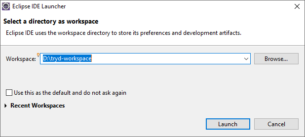

* Se preferir, pode mudar o idioma da interface instalando um language pack: https://www.eclipse.org/babel/downloads.php

## Configurar JVM
  * O desenvolvimento e a execução dos plugins devem ser feitos com a mesma versão JRE que vem junto com o Tryd, versão 1.8
  * Acesse o menu Window - Preferences - Java - Installed JREs
  * Clique em Add e selecione Standard VM
  * Em JRE home selecione o diretório onde estar instalada a JRE do Tryd, geralmente em C:\Tryd5\jre

  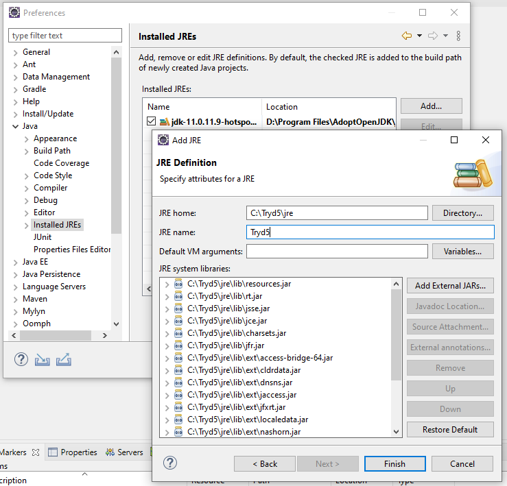
  
## Configurar Target Platform
  * A execução do plugin precisa de uma plataforma eclipse (Tryd) onde serão testados e depurados
  * Acesso o menu Window - Preferences - Plug-in Development - Target Platfom
  * Clique em Add e selecione a opção Nothing
  * Dê um nome pra plataforma (e.g: Tryd 6)
  * Na aba Locations clique em Add e selecione Installation. Na próxima tela clique em Browse e selecione o diretório on o Tryd está instalado, geralmente C:\Tryd5
  * Na aba Content, em 'Manage using' selecione a opção Plug-ins e certifique de que todos os plugins estejam selecionados
  * Na aba Environment defina as veriáveis conforme abaixo:

  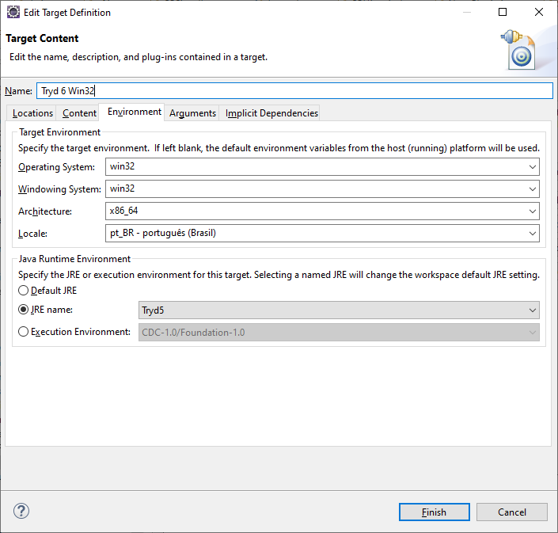

  * Na aba Arguments ente o valor abaixo no campo VM Arguments (ctrl-c ctrl-v):
  
  `-Dosgi.requiredJavaVersion=1.8 --add-modules=ALL-SYSTEM -XX:+UseG1GC -XX:+UseStringDeduplication -Dosgi.requiredJavaVersion=1.8 -Dosgi.dataAreaRequiresExplicitInit=true -Xms256m -Xmx1024m -Declipse.p2.max.threads=10 -Doomph.update.url=http://download.eclipse.org/oomph/updates/milestone/latest -Doomph.redirection.index.redirection=index:/->http://git.eclipse.org/c/oomph/org.eclipse.oomph.git/plain/setups/`
  * Na janela Target Platform marque a plataforma como ativa

## Criar projeto de plug-in
 * Crie um projeto do tipo Plug-in acessando o menu File - New - Project...
 * Selecione o wizard 'Plug-in Project'
 * Dê um nome ao projeto e faça as seleções conforme abaixo:

 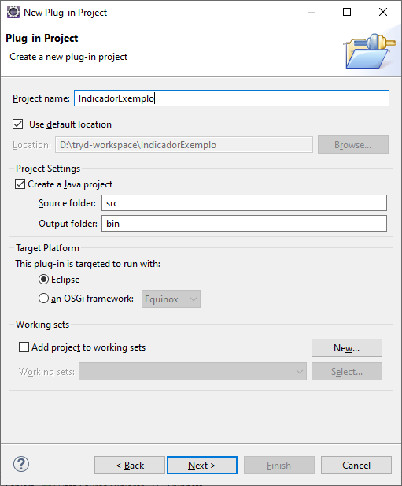

 * Preencha as propriedades conforme necessário. Selecionar JavaSE-1.8 em Execution Environment.

 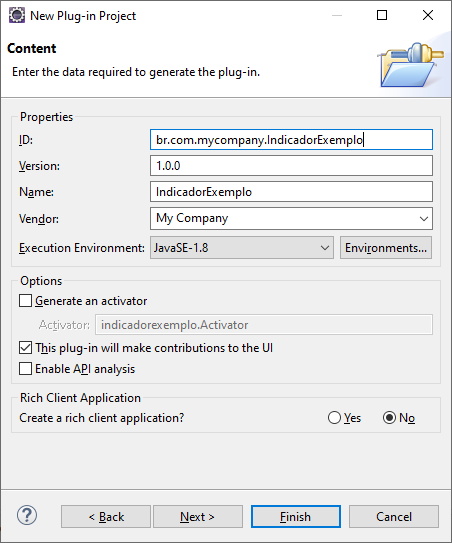
 
 * Não selecione nenhum template na janela Templates

## Importar indicador
 * Se preferir, você pode importar um dos indicadores deste repositório
 * Clone ou faça download do repositório e importe no eclipse

## Configurar propriedades do projeto
 * Verifique as configurações das propriedades do projeto conforme abaixo.
 
 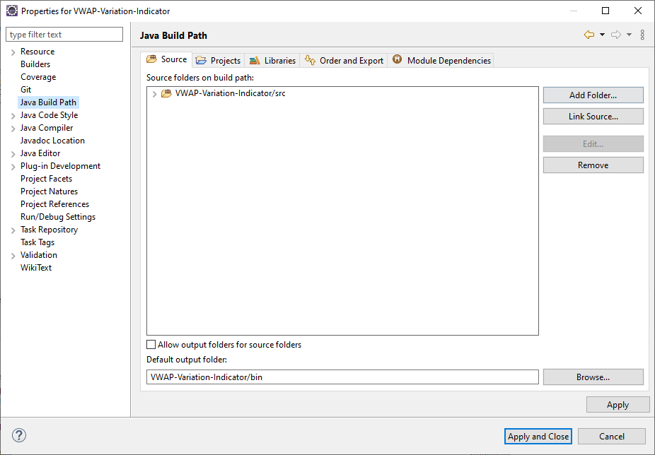
 
 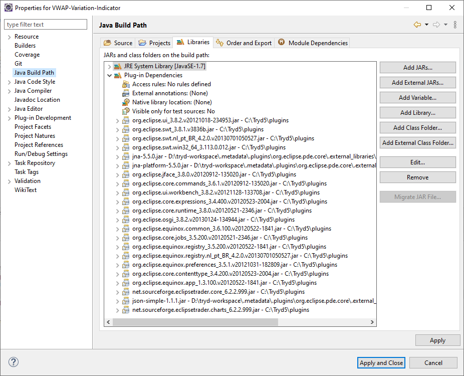
 
 * Mesmo o Tryd rodando com JRE 1.8, o runtime dos plugins deve ser configurado como JavaSE-1.7

 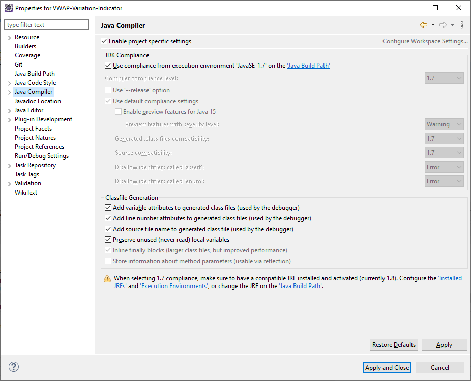
 
## Configurar execução do plugin

 * Acesso o menu Run - Run Configurations...
 * Crie uma nova configuração do tipo Eclipse Application e configure as propriedades conforme abaixo:

* Atentar para os valores de Location e Execution environment

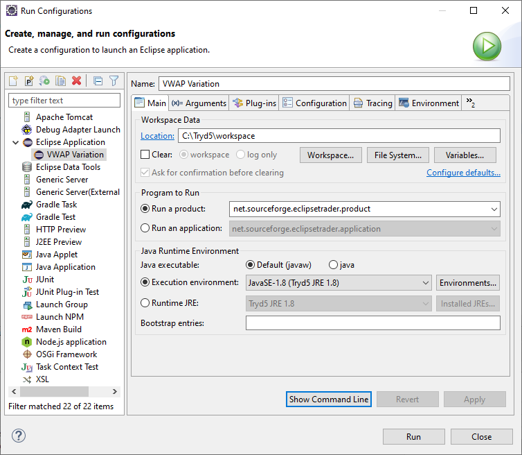

 * Os argumentos da VM já aparecerão configurados, são os mesmo da Target Platform (altere apenas se precisar de argumentos específicos para rodar seu plugin)
 * Atentar para a opção Working directory

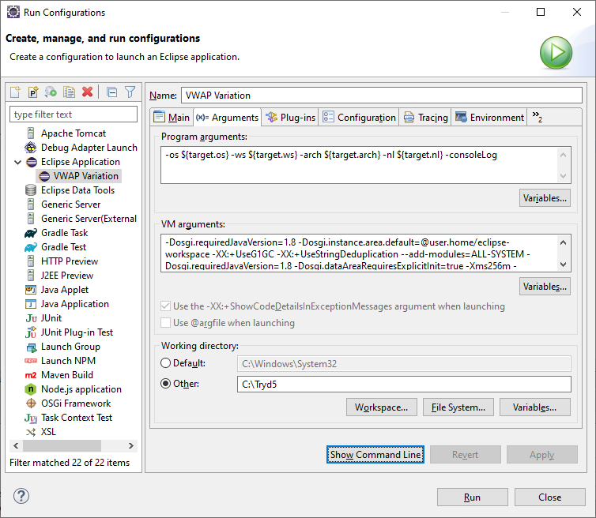

 * Na aba Plug-ins selecione em Workspace o(s) plugin(s) que deseja incluir nesta execução do Tryd (geralmente o plugin que você está testando ou depurando)
 * Selecione todos os plugins de Target Platform com exceção do plugin que você está testando ou depurando se ele aparecer na lista (acontece quando vc já instalou o plugin no Tryd)
 
 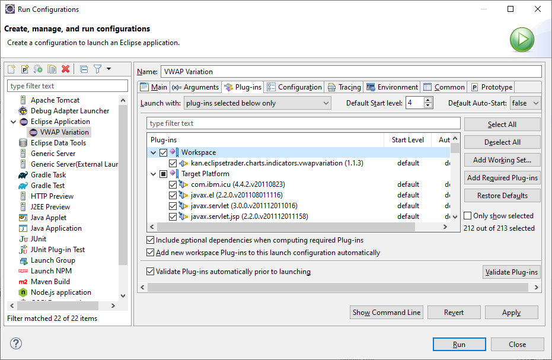

 * Atentar para a opção Use an existing config.ini file as a template

 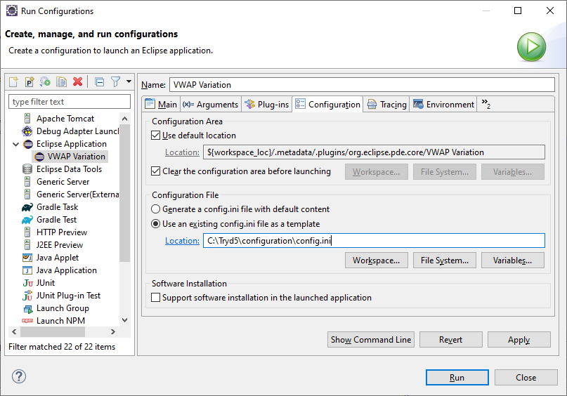

# Executando o plugin
 * Para executar o plugin, clique na seta do ícone de execuções e selecione a execução desejada.

 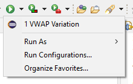
 
 * Para executar o plugin em modo debug, clique na seta do ícone de debug e selecione a execução desejada.

 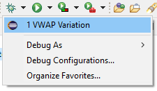
 
 * O indicador estará disponível para ser inserido no gráfico

 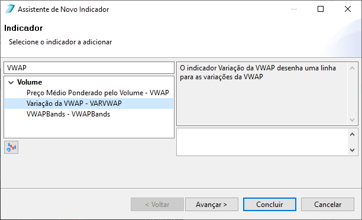

# Exportando o plugin
 * Siga as instruções de como criar um prejeto feature e um update site em: https://www.vogella.com/tutorials/EclipsePlugin/article.html#exercise-create-a-feature-for-your-plug-in

# Instalando o plugin no Tryd
 * Abra a plataforma Tryd e acesse o menu Ajuda - Instalar novo programa
 * Clique em Adicionar (repositório)
 * Selecione Local e especifique o caminho do plugin exportado
 * Especifique um nome para identificar esse repositório
 * Escolha o repositório adicionado e marque os plugins que deseja instalar
